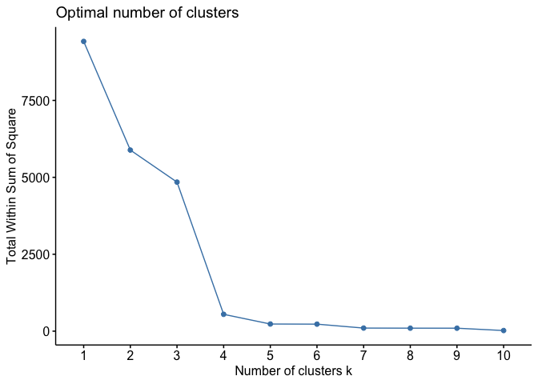

Análisis: accidentes de tráfico en Nueva York durante 2020
================
Carlos Fernández Rosauro
7/13/2021

``` r
library(dplyr)
library(factoextra)
library(cluster)
library(data.table)
library(mltools)
library(data.table)
library(C50)
```

------------------------------------------------------------------------

### Planteamiento del problema

------------------------------------------------------------------------

#### Introducción

El proyecto de minería de datos definido para se estructura con el
objetivo de obtener conocimiento sobre los accidentes de tráfico en la
ciudad de Nueva York durante todo el año 2020. La extracción de
conocimiento se llevará a cabo implementando métodos tanto supervisados
como no supervisados:

-   Modelo de regresión para entender el número de fallecidos por
    accidente en función de distintas variables.

-   Método de agregación para entender cómo ocurren los accidentes,
    dónde y en qué momento.

La utilidad de este análisis puede ir orientada fundamentalmente a las
instituciones públicas, de tal forma que:

1.  Se entienda cómo se deben orientar las campañas de concienciación
    para evitar los accidentes.

2.  Se determine qué características son fundamentales a la hora de
    producirse un accidente grave, como información imprescindible para
    la futura planificación urbana.

Para el modelo de regresión para el cálculo de fallecidos se optará por
una regresión lineal múltiple con variables independientes o predictivas
tanto categóricas (en su mayoría), como numéricas. Para el método de
agregación se realizará un análisis de conglomerados del que obtendrá el
mejor método de cluster a utilizar.

#### Origen de los datos

El conjunto de datos a utilizar se obtendrá de la plataforma de datos
abiertos de la ciudad de Nueva York, con enlace
“<https://data.cityofnewyork.us/Public-Safety/Motor-Vehicle-Collisions-Crashes/h9gi-nx95>”.
Se trata de un fichero en formato “.csv” donde vienen todos los datos
organizados en forma de tabla. Las variables que seleccionamos y que
utilizaremos en nuestro proyecto son:

**CRASH.TIME** string (convertido en factor) con la hora entera en la
que se produjo el accidente.

**BOROUGH** string (convertido en factor) con el distrito en el que se
produjo el accidente.

**NUMBER.OF.PERSONS.INJURED** número entero con la cantidad de personas
heridas en el accidente.

**NUMBER.OF.PERSONS.KILLED** número entero con la cantidad de personas
fallecidas en el accidente. Esta será la variable dependiente de nuestro
modelo de regresión lineal.

**CONTRIBUTING.FACTOR.VEHICLE.1** string (convertido en factor) con el
principal factor determinado que fue causa del accidente.

**VEHICLE.TYPE.CODE.1** string (convertido en factor) con el tipo de
vehículo del principal involucrado en la causa del accidente.

#### Preparación de los datos

##### Limpieza

En primer lugar nos aseguraremos de la calidad de los datos: errores,
valores repetidos o instancias incompletas. Si por ejemplo encontrásemos
NAs en la única variable numérica “NUMBER.OF.PERSONS.INJURED”, podríamos
imputar dichos valores utilizando la media de la variable o mediante una
interpolación (lineal, polinómica, etc.). Por otro lado, dado que se
trata de un conjunto de datos bastante grande, nos desharemos de todas
aquellas filas que no contengan información para cualquiera de las
variables cualitativas, ya que todas ellas van a resultar
imprescindibles para el análisis, y siendo variables con valores
discretos y cualitativos, sin contar con una mayor información de
dominio, no podemos interpolar los valores no encontrados o no
especificados con una base sólida de conocimiento de causa.

##### Transformación

Dado que algunas de las variables cualitativas cuentan con una gran
cantidad de clases posibles, y con el objetivo de facilitar el cálculo
de nuestros modelos a nivel computacional, reduciremos la cantidad de
clases o factores (en las variables tipo de vehículo y causa del
accidente) atendiendo a la frecuencia con los que las observamos.
Mientras que estas decisiones limitan el alcance de nuestros resultados
al no contemplar todos los tipos de vehículos involucrados o de causas
del accidente, nos permitirán obtener conclusiones más exactas sobre las
situaciones de accidente más comunes.

Tanto para el modelo supervisado (regresión) como para el modelo no
supervisado (cluster), necesitamos que todas las variables tengan un
formato numérico adecuado. Primero deberíamos realizar expansiones de
atributo para todas las variables categóricas mediante la técnica de
one-hot encoding, de tal forma que crearemos un vector de 0 y 1 para
cada una de las posibles clases que dichas variables pueden tomar. Dada
la cantidad de variables categóricas con las que contamos y la cantidad
de clases diferentes que las componen, es este punto el más delicado del
análisis, ya que estaremos generando una gran cantidad de nuevas
variables “dummy”. Para reducir esta problemática, generaremos alguna
variable o característica nueva que capture una cantidad mayor de
información de tal forma que la dimensionalidad no crezca de forma
excesiva, más específicamente a partir de la variable de la hora de los
accidentes.

Una vez contamos con todas las variables en formato numérico, deberíamos
normalizar el resto atributos (variables numéricas) a escala 0-1. De
esta forma, todas las variables estarían en el mismo formato y escala.

##### Reducción de dimensionalidad

Realizaremos un análisis de componentes principales para generar los
componentes necesarios que utilizaremos para alimentar los modelos. Tras
haber optado anteriormente por reducir el número de clases a analizar,
así como al haber generado alguna característica nueva que resuma
información, deberíamos estar en un buen lugar para interpretar
adecuadamente los factores generados.

#### Construcción de los modelos

Una vez preparados los datos, continuaremos con la construcción de
nuestros dos modelos:

1.  El proceso de construcción de nuestro primer modelo se definiría
    como un proceso de aprendizaje supervisado, pues consistiría en
    ajustar la regresión a los datos de personas fallecidas con los
    otros atributos como variables predictivas. Se utilizaría un método
    batch, ya que queremos entrenar el modelo de una vez en base al
    conjunto de datos obtenido. Podríamos definir la métrica objetivo a
    optimizar; claramente al tratarse de un modelo de regresión lineal,
    como la diferencia de los mínimos al cuadrado. Teniendo en cuenta
    que en este modelo no hay hiperparámetros, no habría más que
    utilizar algún método automatizado para encontrar nuestro modelo
    óptimo, usaríamos el descenso del gradiente estocástico para
    encontrar el óptimo de nuestra métrica o función de pérdida. Para
    este caso, comenzaríamos antes de nada por dividir los datos de
    trabajo en dos subconjuntos: entrenamiento y test.

2.  El proceso de construcción de nuestro segundo modelo se definiría
    como un proceso de aprendizaje no supervisado, implementando un
    método de agregación no jerárquico, para lo que realizaremos un
    análisis previo mediante el uso de diferentes criterios de selección
    de la cantidad óptima de clusters (ej: criterios de la silueta
    media, Calinski-Harabasz y Cubic Clustering Criterion). A
    continuación aplicaremos el algoritmo k-means para construir el
    modelo de agregación, ya que resulta uno de los métodos más fáciles
    de implementar y se puede construir haciendo uso de diferentes
    medidas de similaridad o distancias.

#### Evaluación de los modelos y conclusiones

Para evaluar el modelo de regresión podríamos utilizar la medida de
error medio absoluto, que debería comportarse bien si hubiese muchos
outliers, teniendo en cuenta los dos subconjuntos para entrenar y
testear. Para el modelo de agregación utilizaremos los propios criterios
de generación definidos anteriormente como herramientas para validar el
modelo, así como la interpretación cualitativa que podamos realizar de
los resultados, es decir, si tienen sentido los clusters generados en
base a los componentes utilizados según conocimiento de dominio.

------------------------------------------------------------------------

### Elección de los datos

------------------------------------------------------------------------

El conjunto de datos seleccionado es el descrito en el apartado
anterior. Se trata de un conjunto que de origen cuenta con cientos de
miles de registros de accidentes de de más de 20 variables cuantitativas
y cualitativas. Esta alta dimensionalidad hace del conjunto uno perfecto
para tareas de aprendizaje tanto supervisado como no supervisado,
especialmente teniendo en cuenta que asumimos que todos los accidentes
que quisiéramos estudiar están reflejados en el mencionado fichero, de
tal forma que al analizar los registros de un año, no estamos analizando
una muestra, si no toda la población de registros de accidentes de ese
año.

------------------------------------------------------------------------

### Análisis exploratorio y limpieza de los datos

------------------------------------------------------------------------

Comenzamos cargando el fichero descargando en formato “.csv”.

``` r
data <- read.csv("Motor_Vehicle_Collisions_-_Crashes.csv", header=T, sep=",")
```

Dado que este fichero cuenta con datos de varios años, necesitamos
filtrar según nuestras especificaciones. Para ello, primero formateamos
adecuadamente la variable de la fecha de los accidentes y observamos por
primera vez el dataset:

``` r
data$CRASH.DATE <- as.Date(data$CRASH.DATE, "%m/%d/%Y")
head(data)
```

    ##   CRASH.DATE CRASH.TIME  BOROUGH ZIP.CODE LATITUDE LONGITUDE
    ## 1 2021-04-14       5:32                NA       NA        NA
    ## 2 2021-04-13      21:35 BROOKLYN    11217 40.68358 -73.97617
    ## 3 2021-04-15      16:15                NA       NA        NA
    ## 4 2021-04-13      16:00 BROOKLYN    11222       NA        NA
    ## 5 2021-04-12       8:25                NA  0.00000   0.00000
    ## 6 2021-04-13      17:11                NA       NA        NA
    ##                LOCATION                   ON.STREET.NAME CROSS.STREET.NAME
    ## 1                                BRONX WHITESTONE BRIDGE                  
    ## 2 (40.68358, -73.97617)                                                   
    ## 3                               HUTCHINSON RIVER PARKWAY                  
    ## 4                                      VANDERVORT AVENUE    ANTHONY STREET
    ## 5            (0.0, 0.0) EDSON AVENUE                                      
    ## 6                                 VERRAZANO BRIDGE UPPER                  
    ##                            OFF.STREET.NAME NUMBER.OF.PERSONS.INJURED
    ## 1                                                                  0
    ## 2 620       ATLANTIC AVENUE                                        1
    ## 3                                                                  0
    ## 4                                                                  0
    ## 5                                                                  0
    ## 6                                                                  0
    ##   NUMBER.OF.PERSONS.KILLED NUMBER.OF.PEDESTRIANS.INJURED
    ## 1                        0                             0
    ## 2                        0                             1
    ## 3                        0                             0
    ## 4                        0                             0
    ## 5                        0                             0
    ## 6                        0                             0
    ##   NUMBER.OF.PEDESTRIANS.KILLED NUMBER.OF.CYCLIST.INJURED
    ## 1                            0                         0
    ## 2                            0                         0
    ## 3                            0                         0
    ## 4                            0                         0
    ## 5                            0                         0
    ## 6                            0                         0
    ##   NUMBER.OF.CYCLIST.KILLED NUMBER.OF.MOTORIST.INJURED NUMBER.OF.MOTORIST.KILLED
    ## 1                        0                          0                         0
    ## 2                        0                          0                         0
    ## 3                        0                          0                         0
    ## 4                        0                          0                         0
    ## 5                        0                          0                         0
    ## 6                        0                          0                         0
    ##   CONTRIBUTING.FACTOR.VEHICLE.1 CONTRIBUTING.FACTOR.VEHICLE.2
    ## 1         Following Too Closely                   Unspecified
    ## 2                   Unspecified                              
    ## 3             Pavement Slippery                              
    ## 4         Following Too Closely                   Unspecified
    ## 5                   Unspecified                   Unspecified
    ## 6         Following Too Closely                   Unspecified
    ##   CONTRIBUTING.FACTOR.VEHICLE.3 CONTRIBUTING.FACTOR.VEHICLE.4
    ## 1                                                            
    ## 2                                                            
    ## 3                                                            
    ## 4                                                            
    ## 5                                                            
    ## 6                                                            
    ##   CONTRIBUTING.FACTOR.VEHICLE.5 COLLISION_ID
    ## 1                                    4407480
    ## 2                                    4407147
    ## 3                                    4407665
    ## 4                                    4407811
    ## 5                                    4406885
    ## 6                                    4407883
    ##                   VEHICLE.TYPE.CODE.1 VEHICLE.TYPE.CODE.2 VEHICLE.TYPE.CODE.3
    ## 1                               Sedan               Sedan                    
    ## 2                               Sedan                                        
    ## 3 Station Wagon/Sport Utility Vehicle                                        
    ## 4                               Sedan                                        
    ## 5 Station Wagon/Sport Utility Vehicle               Sedan                    
    ## 6                               Sedan           Box Truck                    
    ##   VEHICLE.TYPE.CODE.4 VEHICLE.TYPE.CODE.5
    ## 1                                        
    ## 2                                        
    ## 3                                        
    ## 4                                        
    ## 5                                        
    ## 6

A continuación, filtramos para los datos de los accidentes en el años
2020:

``` r
selected_data <- data[data$CRASH.DATE <= "2020-12-31" & data$CRASH.DATE > "2019-12-31", ]
```

Ahora seleccionaremos las variables definidas en el primer apartado.
Para la variable hora del accidente, nos interesa formatearla de tal
forma que sea de tipo factor con una clase para cada una de los 24 horas
del día, por lo que comenzamos dejando únicamente el valor de la hora
entera, es decir, la parte HH del formato HH:MM:

``` r
selected_data <- select(selected_data, CRASH.TIME, BOROUGH, NUMBER.OF.PERSONS.INJURED, NUMBER.OF.PERSONS.KILLED, CONTRIBUTING.FACTOR.VEHICLE.1, VEHICLE.TYPE.CODE.1)
selected_data$CRASH.TIME <-  gsub("\\:.*","",selected_data$CRASH.TIME)
selected_data$CRASH.TIME <- as.numeric(selected_data$CRASH.TIME)
```

Comprobamos la estructura de los datos y analizamos si cada
variable/columna cuenta con el tipo correcto de datos.

``` r
str(selected_data)
```

    ## 'data.frame':    112854 obs. of  6 variables:
    ##  $ CRASH.TIME                   : num  15 16 20 15 2 16 1 7 18 18 ...
    ##  $ BOROUGH                      : chr  "" "" "" "" ...
    ##  $ NUMBER.OF.PERSONS.INJURED    : int  0 0 0 0 0 0 1 0 0 0 ...
    ##  $ NUMBER.OF.PERSONS.KILLED     : int  0 0 0 0 0 0 0 0 1 0 ...
    ##  $ CONTRIBUTING.FACTOR.VEHICLE.1: chr  "Driver Inattention/Distraction" "Reaction to Uninvolved Vehicle" "Following Too Closely" "Driver Inattention/Distraction" ...
    ##  $ VEHICLE.TYPE.CODE.1          : chr  "Sedan" "Sedan" "Sedan" "Sedan" ...

Contamos con 6 variables y un total de 112854 registros. Deberemos
modificar los tipos de variable para todas aquellas que son “string”. Lo
haremos más adelante en el paso de transformación.

Ahora obtendremos los valores estadísticos básicos de las distintas
variables y las cantidades de valores vacíos.

``` r
summary(selected_data)
```

    ##    CRASH.TIME     BOROUGH          NUMBER.OF.PERSONS.INJURED
    ##  Min.   : 0.0   Length:112854      Min.   : 0.0000          
    ##  1st Qu.: 9.0   Class :character   1st Qu.: 0.0000          
    ##  Median :14.0   Mode  :character   Median : 0.0000          
    ##  Mean   :13.1                      Mean   : 0.3951          
    ##  3rd Qu.:18.0                      3rd Qu.: 1.0000          
    ##  Max.   :23.0                      Max.   :15.0000          
    ##  NUMBER.OF.PERSONS.KILLED CONTRIBUTING.FACTOR.VEHICLE.1 VEHICLE.TYPE.CODE.1
    ##  Min.   :0.000000         Length:112854                 Length:112854      
    ##  1st Qu.:0.000000         Class :character              Class :character   
    ##  Median :0.000000         Mode  :character              Mode  :character   
    ##  Mean   :0.002375                                                          
    ##  3rd Qu.:0.000000                                                          
    ##  Max.   :4.000000

Por el momento no observamos sorpresas: las horas se comportan entre los
valores 0 y 23 y no parece haber valores atípicos o outliers para las
variables de personas heridas y fallecidas. Para poder continuar con la
limpieza y el preprocesamiento necesitamos transformar los datos.

------------------------------------------------------------------------

### Transformación y discretización. Continuación de la limpieza.

------------------------------------------------------------------------

Generaremos una nueva variable o característica para las horas de los
accidentes. Se agruparán las horas en función de tres tipos de periodos
de tiempo: madrugada (01-08), jornada de trabajo (09-17) y tarde-noche
(18-24). Estas agrupaciones se han realizado atendiendo especialmente a
los horarios habituales de trabajo y ocio a lo largo del día. Parece
razonable asumir que de haber información dependiente de la hora de los
accidentes, debería poderse capturar de esta manera. Esta transformación
nos permitirá además, no obtener un exceso de variables “dummy” cuando
realicemos más tarde una codificación de tipo “one-hot” sobre las
variables discretas.

``` r
selected_data$CRASH.TIME <- cut(selected_data$CRASH.TIME, breaks = c(0, 9, 18, 23), labels = c("01-08", "09-17", "18-24"))
```

Ahora podemos transformar el resto de variables cualitativas en
factores:

``` r
for(i in 1:ncol(selected_data)){
  if (is.character(selected_data[,i]))
    selected_data[,i] <- as.factor(selected_data[,i])
}
```

Volvemos a generar las estadísticas básicas de todas las variables y ya
podemos empezar a observar algunos datos interesantes: la mayor cantidad
de accidentes se observan en horario 09-17, con vehículos involucrados
de tipo Sedán o utilitarios y con causa principal la distracción del
conductor.

``` r
summary(selected_data)
```

    ##  CRASH.TIME             BOROUGH      NUMBER.OF.PERSONS.INJURED
    ##  01-08:25648                :39207   Min.   : 0.0000          
    ##  09-17:60191   BRONX        :14292   1st Qu.: 0.0000          
    ##  18-24:22398   BROOKLYN     :25460   Median : 0.0000          
    ##  NA's : 4617   MANHATTAN    :10847   Mean   : 0.3951          
    ##                QUEENS       :20660   3rd Qu.: 1.0000          
    ##                STATEN ISLAND: 2388   Max.   :15.0000          
    ##                                                               
    ##  NUMBER.OF.PERSONS.KILLED                CONTRIBUTING.FACTOR.VEHICLE.1
    ##  Min.   :0.000000         Unspecified                   :29502        
    ##  1st Qu.:0.000000         Driver Inattention/Distraction:28609        
    ##  Median :0.000000         Following Too Closely         : 7589        
    ##  Mean   :0.002375         Failure to Yield Right-of-Way : 7184        
    ##  3rd Qu.:0.000000         Passing or Lane Usage Improper: 4264        
    ##  Max.   :4.000000         Passing Too Closely           : 4036        
    ##                           (Other)                       :31670        
    ##                           VEHICLE.TYPE.CODE.1
    ##  Sedan                              :52752   
    ##  Station Wagon/Sport Utility Vehicle:40710   
    ##  Taxi                               : 3767   
    ##  Pick-up Truck                      : 2680   
    ##  Box Truck                          : 2046   
    ##  Bike                               : 1467   
    ##  (Other)                            : 9432

Con respecto a los valores vacíos, ya observamos anteriormente que en la
variable de las causas identificadas de los accidentes, existe un gran
número de registros sin especificar: con valor “Unspecified”. Buscamos
por otro lado valores vacíos normales y “NAs”:

``` r
colSums(is.na(selected_data))
```

    ##                    CRASH.TIME                       BOROUGH 
    ##                          4617                             0 
    ##     NUMBER.OF.PERSONS.INJURED      NUMBER.OF.PERSONS.KILLED 
    ##                             0                             0 
    ## CONTRIBUTING.FACTOR.VEHICLE.1           VEHICLE.TYPE.CODE.1 
    ##                             0                             0

``` r
colSums(selected_data=="")
```

    ##                    CRASH.TIME                       BOROUGH 
    ##                            NA                         39207 
    ##     NUMBER.OF.PERSONS.INJURED      NUMBER.OF.PERSONS.KILLED 
    ##                             0                             0 
    ## CONTRIBUTING.FACTOR.VEHICLE.1           VEHICLE.TYPE.CODE.1 
    ##                           513                          1073

Dado el gran tamaño del dataset, optamos por eliminar aquellos registros
con valores vacíos.

``` r
filtered_data <- selected_data[!(selected_data$BOROUGH=="" | selected_data$CONTRIBUTING.FACTOR.VEHICLE.1=="" | selected_data$VEHICLE.TYPE.CODE.1=="" | selected_data$CRASH.TIME==""), ]
```

Continuando con las codificaciones, tal y como se comentó en el apartado
1, dos de nuestras variables (causa del accidente y tipo de vehículo)
cuentas con una gran cantidad de clases posibles. Esto dificulta el
análisis por dos motivos: por un lado se generarán un exceso de
variables “dummy” si queremos codificar adecuadamente las clases, y por
otro, los modelos que generemos tendrán peor capacidad de generalizar
sobre los datos al estar alimentados por las clases minoritarias, lo que
aumentaría la variabilidad. Por estas razones, se ha optado por reducir
el número de clases a aquellas que aparecen en como mínimo el 2% de los
registros, es decir, aquellas que muestran una frecuencia de mínimo al
rededor de 2400 ocurrencias.

Para ello, a continuación se muestran las clases que superan el filtro y
se generan las reglas pertinentes a aplicar sobre el conjunto de datos:

``` r
head(sort(table(filtered_data$CONTRIBUTING.FACTOR.VEHICLE.1), decreasing=TRUE), 5)[-1]
```

    ## 
    ## Driver Inattention/Distraction  Failure to Yield Right-of-Way 
    ##                          17466                           4833 
    ##          Following Too Closely               Backing Unsafely 
    ##                           3017                           3013

``` r
filter_1 <- names(head(sort(table(filtered_data$CONTRIBUTING.FACTOR.VEHICLE.1), decreasing=TRUE), 5))[-1]
```

``` r
head(sort(table(filtered_data$VEHICLE.TYPE.CODE.1), decreasing=TRUE), 3)
```

    ## 
    ##                               Sedan Station Wagon/Sport Utility Vehicle 
    ##                               32801                               25549 
    ##                                Taxi 
    ##                                2350

``` r
filter_2 <- names(head(sort(table(filtered_data$VEHICLE.TYPE.CODE.1), decreasing=TRUE), 3))
```

Aplicamos los filtros y refactorizamos el dataframe para que detecte
adecuadamente la nueva cantidad de clases por cada variable factor:

``` r
filtered_data <- filtered_data[filtered_data$CONTRIBUTING.FACTOR.VEHICLE.1 %in% filter_1 & filtered_data$VEHICLE.TYPE.CODE.1 %in% filter_2, ]
filtered_data <- as.data.frame(lapply(filtered_data, function (x) if (is.factor(x)) factor(x) else x))
```

Observamos de nuevo nuestro dataframe filtrado y tras todas la
operaciones de limpieza y filtrado, obtenemos un total de 24713
registros con los que trabajar.

``` r
head(filtered_data)
```

    ##   CRASH.TIME   BOROUGH NUMBER.OF.PERSONS.INJURED NUMBER.OF.PERSONS.KILLED
    ## 1      01-08 MANHATTAN                         1                        0
    ## 2      09-17 MANHATTAN                         0                        0
    ## 3      09-17     BRONX                         0                        0
    ## 4      09-17    QUEENS                         1                        0
    ## 5      09-17  BROOKLYN                         0                        0
    ## 6      09-17  BROOKLYN                         0                        0
    ##    CONTRIBUTING.FACTOR.VEHICLE.1                 VEHICLE.TYPE.CODE.1
    ## 1 Driver Inattention/Distraction                               Sedan
    ## 2 Driver Inattention/Distraction Station Wagon/Sport Utility Vehicle
    ## 3 Driver Inattention/Distraction                               Sedan
    ## 4               Backing Unsafely Station Wagon/Sport Utility Vehicle
    ## 5  Failure to Yield Right-of-Way Station Wagon/Sport Utility Vehicle
    ## 6 Driver Inattention/Distraction Station Wagon/Sport Utility Vehicle

``` r
str(filtered_data)
```

    ## 'data.frame':    24713 obs. of  6 variables:
    ##  $ CRASH.TIME                   : Factor w/ 3 levels "01-08","09-17",..: 1 2 2 2 2 2 2 1 2 2 ...
    ##  $ BOROUGH                      : Factor w/ 5 levels "BRONX","BROOKLYN",..: 3 3 1 4 2 2 2 4 2 4 ...
    ##  $ NUMBER.OF.PERSONS.INJURED    : int  1 0 0 1 0 0 1 3 0 0 ...
    ##  $ NUMBER.OF.PERSONS.KILLED     : int  0 0 0 0 0 0 0 0 0 0 ...
    ##  $ CONTRIBUTING.FACTOR.VEHICLE.1: Factor w/ 4 levels "Backing Unsafely",..: 2 2 2 1 3 2 3 3 3 2 ...
    ##  $ VEHICLE.TYPE.CODE.1          : Factor w/ 3 levels "Sedan","Station Wagon/Sport Utility Vehicle",..: 1 2 1 2 2 2 1 2 2 1 ...

Ahora que tenemos nuestras variables adecuadamente preprocesadas,
podemos apoyar los comentarios anteriores observando las distribuciones
de frecuencias de forma gráfica:

``` r
plot(filtered_data$CRASH.TIME)
```

<!-- -->

``` r
plot(filtered_data$CONTRIBUTING.FACTOR.VEHICLE.1, las=2)
```

<!-- -->

``` r
plot(filtered_data$VEHICLE.TYPE.CODE.1)
```

<!-- -->

Llegamos al punto en el que debemos codificar las variables categóricas.
El método seleccionado es el “one-hot encoding” de tal forma que se
generen nuevas variables “dummy” binarias para cada posible clase en las
variables de tipo factor. Es necesario utilizar un método de este tipo
de tal forma que las codificaciones computen adecuadamente en los
modelos que ajustaremos más tarde, por lo que no se deberían utilizar
métodos de codificación simple que den más peso a unas clases que a
otras.

``` r
encoded_data <- one_hot(as.data.table(filtered_data), sparsifyNAs = FALSE, naCols = FALSE, dropCols = TRUE, dropUnusedLevels = FALSE)
```

Observamos los nombres de las distintas variables “dummy” generadas:

``` r
colnames(encoded_data)
```

    ##  [1] "CRASH.TIME_01-08"                                            
    ##  [2] "CRASH.TIME_09-17"                                            
    ##  [3] "CRASH.TIME_18-24"                                            
    ##  [4] "BOROUGH_BRONX"                                               
    ##  [5] "BOROUGH_BROOKLYN"                                            
    ##  [6] "BOROUGH_MANHATTAN"                                           
    ##  [7] "BOROUGH_QUEENS"                                              
    ##  [8] "BOROUGH_STATEN ISLAND"                                       
    ##  [9] "NUMBER.OF.PERSONS.INJURED"                                   
    ## [10] "NUMBER.OF.PERSONS.KILLED"                                    
    ## [11] "CONTRIBUTING.FACTOR.VEHICLE.1_Backing Unsafely"              
    ## [12] "CONTRIBUTING.FACTOR.VEHICLE.1_Driver Inattention/Distraction"
    ## [13] "CONTRIBUTING.FACTOR.VEHICLE.1_Failure to Yield Right-of-Way" 
    ## [14] "CONTRIBUTING.FACTOR.VEHICLE.1_Following Too Closely"         
    ## [15] "VEHICLE.TYPE.CODE.1_Sedan"                                   
    ## [16] "VEHICLE.TYPE.CODE.1_Station Wagon/Sport Utility Vehicle"     
    ## [17] "VEHICLE.TYPE.CODE.1_Taxi"

Finalmente debemos discretizar las dos variables numéricas utilizadas:
número de personas heridas y número de personas fallecidas.

``` r
encoded_data$NUMBER.OF.PERSONS.INJURED <- scale(encoded_data$NUMBER.OF.PERSONS.INJURED)
encoded_data$NUMBER.OF.PERSONS.KILLED <- scale(encoded_data$NUMBER.OF.PERSONS.KILLED)
```

------------------------------------------------------------------------

### Reducción de la dimensionalidad y primeras conclusiones.

------------------------------------------------------------------------

Para la reducción de la dimensionalidad; la cual parece obvia dada la
alta cantidad de variables “dummy” generadas, realizaremos una PCA. Tras
generar los componentes, utilizaremos el criterio de la media
aritmética, de tal forma que nos quedaremos únicamente con los
componentes cuya varianza sea superior a la unidad:

``` r
componentes <- prcomp(encoded_data)
summary(componentes)
```

    ## Importance of components:
    ##                           PC1    PC2    PC3     PC4     PC5     PC6     PC7
    ## Standard deviation     1.0052 0.9988 0.6904 0.60661 0.57707 0.56334 0.45910
    ## Proportion of Variance 0.2289 0.2260 0.1080 0.08336 0.07544 0.07189 0.04775
    ## Cumulative Proportion  0.2289 0.4549 0.5628 0.64621 0.72165 0.79354 0.84128
    ##                            PC8     PC9    PC10    PC11    PC12    PC13
    ## Standard deviation     0.45409 0.38959 0.36792 0.32335 0.24497 0.20675
    ## Proportion of Variance 0.04671 0.03438 0.03066 0.02368 0.01359 0.00968
    ## Cumulative Proportion  0.88799 0.92237 0.95304 0.97672 0.99032 1.00000
    ##                             PC14      PC15      PC16      PC17
    ## Standard deviation     1.122e-13 4.363e-14 2.045e-14 1.115e-14
    ## Proportion of Variance 0.000e+00 0.000e+00 0.000e+00 0.000e+00
    ## Cumulative Proportion  1.000e+00 1.000e+00 1.000e+00 1.000e+00

Seleccionaremos los dos primeros componentes, ya que, aunque el segundo
no alcanza la unidad (se queda muy cerca), este muestra una proporción
de varianza muy alta, similar a la del primer componente.

``` r
componentes$sdev^2
```

    ##  [1] 1.010355e+00 9.976837e-01 4.766541e-01 3.679723e-01 3.330123e-01
    ##  [6] 3.173547e-01 2.107731e-01 2.061966e-01 1.517784e-01 1.353636e-01
    ## [11] 1.045553e-01 6.001186e-02 4.274705e-02 1.258926e-26 1.903298e-27
    ## [16] 4.184046e-28 1.243278e-28

Finalmente, mostramos los componentes seleccionados y los pesos
aportados por cada variable:

``` r
componentes$rotation[, 1:2]
```

    ##                                                                        PC1
    ## CRASH.TIME_01-08                                             -0.0113555363
    ## CRASH.TIME_09-17                                             -0.0135902512
    ## CRASH.TIME_18-24                                              0.0249457875
    ## BOROUGH_BRONX                                                 0.0037995623
    ## BOROUGH_BROOKLYN                                              0.0098956268
    ## BOROUGH_MANHATTAN                                            -0.0112545504
    ## BOROUGH_QUEENS                                               -0.0043687301
    ## BOROUGH_STATEN ISLAND                                         0.0019280914
    ## NUMBER.OF.PERSONS.INJURED                                     0.8924217776
    ## NUMBER.OF.PERSONS.KILLED                                      0.4416078934
    ## CONTRIBUTING.FACTOR.VEHICLE.1_Backing Unsafely               -0.0352482608
    ## CONTRIBUTING.FACTOR.VEHICLE.1_Driver Inattention/Distraction -0.0328750206
    ## CONTRIBUTING.FACTOR.VEHICLE.1_Failure to Yield Right-of-Way   0.0689233951
    ## CONTRIBUTING.FACTOR.VEHICLE.1_Following Too Closely          -0.0008001137
    ## VEHICLE.TYPE.CODE.1_Sedan                                     0.0078810363
    ## VEHICLE.TYPE.CODE.1_Station Wagon/Sport Utility Vehicle      -0.0139562068
    ## VEHICLE.TYPE.CODE.1_Taxi                                      0.0060751705
    ##                                                                        PC2
    ## CRASH.TIME_01-08                                              0.0049212230
    ## CRASH.TIME_09-17                                              0.0065010361
    ## CRASH.TIME_18-24                                             -0.0114222591
    ## BOROUGH_BRONX                                                -0.0041996698
    ## BOROUGH_BROOKLYN                                             -0.0069376581
    ## BOROUGH_MANHATTAN                                             0.0035085852
    ## BOROUGH_QUEENS                                                0.0067626842
    ## BOROUGH_STATEN ISLAND                                         0.0008660584
    ## NUMBER.OF.PERSONS.INJURED                                    -0.4399885137
    ## NUMBER.OF.PERSONS.KILLED                                      0.8970785694
    ## CONTRIBUTING.FACTOR.VEHICLE.1_Backing Unsafely                0.0176800384
    ## CONTRIBUTING.FACTOR.VEHICLE.1_Driver Inattention/Distraction  0.0096436597
    ## CONTRIBUTING.FACTOR.VEHICLE.1_Failure to Yield Right-of-Way  -0.0242598764
    ## CONTRIBUTING.FACTOR.VEHICLE.1_Following Too Closely          -0.0030638217
    ## VEHICLE.TYPE.CODE.1_Sedan                                    -0.0100718323
    ## VEHICLE.TYPE.CODE.1_Station Wagon/Sport Utility Vehicle       0.0146004468
    ## VEHICLE.TYPE.CODE.1_Taxi                                     -0.0045286145

En este punto, dado que seguimos contando con un “alto” número de
variables para realizar una interpretación superficial, resulta
complicado describir de forma exacta la estructura de los componentes,
ya que existen muchos pesos a repartir. En cualquier caso, podríamos
aproximar las siguientes conclusiones:

1.  Las variables numéricas muestran un gran peso en ambos componentes
    en una u otra dirección. Esto resulta obvio teniendo en cuenta que
    cada una de estas dos variables resulta única en la definición de la
    información que contienen, en contraposición al resto de variables
    que capturan información desglosada por clases. Además, resulta muy
    interesante observar la dirección de estas relaciones: en el
    componente 1 se indica que un alto peso en personas heridas se
    relaciona con un menor peso en personas fallecidas en la misma
    dirección y en el componente 2 se indica que un alto peso en
    personas fallecidas se relaciona con cierto peso negativo en las
    personas heridas: más personas heridas parecen indicar más
    posibilidades de fallecidos pero que haya fallecidos no implica
    necesariamente que hubiese personas heridas.

2.  El primer componente parece definir cierta relación entre la
    cantidad de personas heridas y fallecidas con el factor “Failure to
    Yield Right-of-Way” que significa “no ceder el paso”, lo cual podría
    ir indicando que esta causa es importante a la hora de desencadenar
    heridos y/o fallecidos.

3.  Con respecto a la aplicación posterior de los modelos, puede que sea
    conveniente comparar resultados utilizando tanto los modelos
    alimentados por los componentes obtenidos como los modelos
    alimentados por las variables preparadas en el paso anterior sin
    reducción de dimensionalidad, ya que siendo los componentes tan
    extensos, puede que sea complicado interpretar los resultados (tanto
    para la regresión como para la agregación).

------------------------------------------------------------------------

## Ajuste y aplicación de un modelo cluster no-supervisado.

------------------------------------------------------------------------

Para implementar el modelo supervisado se ha utilizado una muestra
correspondiente al 20% de los registros del conjunto de datos (4800
filas), más concretamente del resultado de la reducción de
dimensionalidad a dos componentes obtenida en la PRA1. Realizamos este
muestreo aleatorio debido al coste computacional de la construcción del
modelo, que en caso de ser del 100% (24000 registros), no es fácilmente
ejecutable en un entorno de desarrollo de un ordenador portátil común.
El método no supervisado seleccionado ha sido el de K-medoids. La razón
es que este método es fácilmente interpretable al igual que K-means pero
es más flexible, al permitir ser construido con una variedad mayor de
distancias, a diferencia de K-means, que está pensado para ser calculado
estrictamente mediante la distancia euclidea o L2.

Antes de comenzar con el análisis cluster, repasaremos las conclusiones
extraídas del análisis de componentes principales que nos permitió
generar los dos componentes con los que trabajaremos:

``` r
componentes$rotation[, 1:2]
```

    ##                                                                        PC1
    ## CRASH.TIME_01-08                                             -0.0113555363
    ## CRASH.TIME_09-17                                             -0.0135902512
    ## CRASH.TIME_18-24                                              0.0249457875
    ## BOROUGH_BRONX                                                 0.0037995623
    ## BOROUGH_BROOKLYN                                              0.0098956268
    ## BOROUGH_MANHATTAN                                            -0.0112545504
    ## BOROUGH_QUEENS                                               -0.0043687301
    ## BOROUGH_STATEN ISLAND                                         0.0019280914
    ## NUMBER.OF.PERSONS.INJURED                                     0.8924217776
    ## NUMBER.OF.PERSONS.KILLED                                      0.4416078934
    ## CONTRIBUTING.FACTOR.VEHICLE.1_Backing Unsafely               -0.0352482608
    ## CONTRIBUTING.FACTOR.VEHICLE.1_Driver Inattention/Distraction -0.0328750206
    ## CONTRIBUTING.FACTOR.VEHICLE.1_Failure to Yield Right-of-Way   0.0689233951
    ## CONTRIBUTING.FACTOR.VEHICLE.1_Following Too Closely          -0.0008001137
    ## VEHICLE.TYPE.CODE.1_Sedan                                     0.0078810363
    ## VEHICLE.TYPE.CODE.1_Station Wagon/Sport Utility Vehicle      -0.0139562068
    ## VEHICLE.TYPE.CODE.1_Taxi                                      0.0060751705
    ##                                                                        PC2
    ## CRASH.TIME_01-08                                              0.0049212230
    ## CRASH.TIME_09-17                                              0.0065010361
    ## CRASH.TIME_18-24                                             -0.0114222591
    ## BOROUGH_BRONX                                                -0.0041996698
    ## BOROUGH_BROOKLYN                                             -0.0069376581
    ## BOROUGH_MANHATTAN                                             0.0035085852
    ## BOROUGH_QUEENS                                                0.0067626842
    ## BOROUGH_STATEN ISLAND                                         0.0008660584
    ## NUMBER.OF.PERSONS.INJURED                                    -0.4399885137
    ## NUMBER.OF.PERSONS.KILLED                                      0.8970785694
    ## CONTRIBUTING.FACTOR.VEHICLE.1_Backing Unsafely                0.0176800384
    ## CONTRIBUTING.FACTOR.VEHICLE.1_Driver Inattention/Distraction  0.0096436597
    ## CONTRIBUTING.FACTOR.VEHICLE.1_Failure to Yield Right-of-Way  -0.0242598764
    ## CONTRIBUTING.FACTOR.VEHICLE.1_Following Too Closely          -0.0030638217
    ## VEHICLE.TYPE.CODE.1_Sedan                                    -0.0100718323
    ## VEHICLE.TYPE.CODE.1_Station Wagon/Sport Utility Vehicle       0.0146004468
    ## VEHICLE.TYPE.CODE.1_Taxi                                     -0.0045286145

1.  Las variables numéricas muestran un gran peso en ambos componentes
    en una u otra dirección. Esto resulta obvio teniendo en cuenta que
    cada una de estas dos variables resulta única en la definición de la
    información que contienen, en contraposición al resto de variables
    que capturan información desglosada por clases. Además, resulta muy
    interesante observar la dirección de estas relaciones: en el
    componente 1 se indica que un alto peso en personas heridas se
    relaciona con un menor peso en personas fallecidas en la misma
    dirección y en el componente 2 se indica que un alto peso en
    personas fallecidas se relaciona con cierto peso negativo en las
    personas heridas: más personas heridas parecen indicar más
    posibilidades de fallecidos pero que haya fallecidos no implica
    necesariamente que hubiese personas heridas.

2.  El primer componente parece definir cierta relación entre la
    cantidad de personas heridas y fallecidas con el factor “Failure to
    Yield Right-of-Way” que significa “no ceder el paso”, lo cual podría
    ir indicando que esta causa es importante a la hora de desencadenar
    heridos y/o fallecidos.

Ahora sí, buscamos la muestra del 20% de los valores del dataset
reducido dimensionalmente:

``` r
set.seed(111)
comps_cluster <- componentes$x[sample(nrow(componentes$x), 4800), 1:2]
```

Tras haber obtenido la muestra, utilizaremos el método de la suma total
de cuadrados para identificar el número adecuado de clusters a utilizar.
El método nos indica claramente que 4 es una buena cantidad de clusters:

``` r
set.seed(1)

fviz_nbclust(comps_cluster, pam, method = "wss")
```

<!-- -->

### Generación del primer modelo

Ahora que hemos obtenido el número adecuado de clústers, procedemos a
implementar el método. Comenzaremos con la distancia euclídea:

``` r
kmed <- pam(comps_cluster, k = 4, metric = "euclidean")
```

Y observamos gráficamente:

``` r
fviz_cluster(kmed, data = comps_cluster)
```

<!-- -->

El resultado gráfico arroja algunas conclusiones interesantes:

-   La imagen parece distribuir los resultados de los cluster 1 a 3 de
    una manera casi “lineal”, lo cual puede explicarse a través de una
    de las conclusiones ya obtenidas en el PCA, que los dos componentes
    parecían complementarse inversamente para muchas de las variables:
    cuando una variable tomaba una dirección en un componente, en muchas
    ocasiones encontraba la dirección opuesta en el otro componente. Lo
    más probable es que esta “linealidad” la marque la variable numérica
    personas heridas, que era una de las que más peso aportaba en ambos
    componentes.

-   El cluster 4 se situa en el cuadrante superior derecho del gráfico,
    lo que significa que el método K-medoids ha interpretado que
    aquellos registros para altos valores en ambos componentes merecían
    un cluster propio. Estos registros coinciden con aquellas variables
    de los componentes que cuentan con la misma dirección y que al tomar
    valores altos, evolucionan de forma similar, fijándonos en los pesos
    de los componentes más arriba, este sería la cantidad de personas
    fallecidas.

### Generación del segundo modelo

Ahora utilizaremos la distancia Manhattan:

``` r
kmed2 <- pam(comps_cluster, k = 4, metric = "manhattan")
```

Y observamos gráficamente:

``` r
fviz_cluster(kmed2, data = comps_cluster)
```

<!-- -->

En este caso, observamos como el cluster 4, que era el que agrupaba los
valores más extremos, captura también en este caso valores más moderados
para ambos componentes. Esto se debe a que al basarse en valores
absolutos (frente a los errores cuadrados de la euclidea), la distancia
Manhattan se ve menos influida por outliers y por tanto debería ofrecer
resultados más robustos. Sin embargo, en este caso tiene más sentido
mantener la distancia euclidea porque resulta más lógico agrupar los
valores extremos de ambos componentes en un único cluster. Para entender
mejor estos resultados podemos acudir a los estadísticos resumen de los
componentes:

``` r
summary(comps_cluster)
```

    ##       PC1                PC2          
    ##  Min.   :-0.57299   Min.   :-4.67565  
    ##  1st Qu.:-0.54189   1st Qu.:-0.38011  
    ##  Median :-0.50870   Median : 0.21646  
    ##  Mean   : 0.02541   Mean   :-0.01282  
    ##  3rd Qu.: 0.69814   3rd Qu.: 0.23125  
    ##  Max.   :15.25676   Max.   :29.65299

Como conclusión del análisis de métodos de agregación, si extrapolamos
los resultados de agrupación de valores de la muestra de componentes al
conjunto de datos original, resultaría razonable decir que el método
K-medoids ha agrupado los casos de accidentes fundamentalmente en
función de la cantidad de personas heridas o de la cantidad de personas
fallecidas, lo cual tiene todo el sentido del mundo si entendemos que la
importancia de los registros de accidentes proviene obviamente de los
resultados de personas perjudicadas o involucradas en los mismos.

------------------------------------------------------------------------

## Implementación de un modelo de árbol de decisión.

------------------------------------------------------------------------

Dado que los componentes obtenidos en la PRA1 definidos por 17 variables
(tras la codificación) no resultan útiles para un proceso de generación
de reglas mediante árboles de decisión, se ha tomado la decisión de
realizar un proceso de selección de características mediante la
herramienta Boruta, ya utilizada en la PEC3, para determinar de antemano
qué variables independientes utilizar. Recordamos que Boruta, mediante
técnicas Random Forest, determina qué variables predictoras aportan más
información a la hora de realizar un problema de clasificación sobre la
variable a predecir. La variable dependiente que seleccionaremos será
“CONTRIBUTING.FACTOR.VEHICLE.1”, ya que nos interesa identificar las
causas de los accidentes en función del resto de variables de tal forma
que podamos entender el contexto de cada accidente (qué lo ocasionó) en
función del lugar, la hora, el tipo de vehículo y la cantidad de
personas involucradas (heridas y fallecidas). Aunque pueda parecer
contraintiutivo (aquí estamos tratando como variable dependiente la
causa del accidente), hay que tener en cuenta que esto no es
necesariamente un análisis de causalidad, sino de relación.

``` r
y <- filtered_data$CONTRIBUTING.FACTOR.VEHICLE.1
x <- filtered_data[, -which(names(filtered_data) == "CONTRIBUTING.FACTOR.VEHICLE.1")]
```

Dado que la ejecución del bloque de código de Boruta llevaba muchas
horas para un análisis de 100 iteraciones, el código aparece comentado y
se describen los resultados: el resultado del análisis indica que las
variables que se confirman como importantes son
“NUMBER.OF.PERSONS.INJURED” y “VEHICLE.TYPE.CODE.1”, y las variables
potencialmente importantes son “BOROUGH” y “NUMBER.OF.PERSONS.KILLED” y
la única variable determinada como no importante es “CRASH.TIME”. De
esta forma, utilizaremos como variables independientes o predictivas
todas menos “CRASH.TIME”. Podemos estar bastante seguros de esta
configuración y del análisis partiendo de la base de que contamos con
muchos registros y con pocas variables.

``` r
#library(Boruta)
#set.seed(111)
#boruta.bank_train <- Boruta(y~., data = x, doTrace = 2)
#print(boruta.bank_train)
```

### Primer árbol de decisión

Para generar el primer árbol de decisión, generaremos el dataframe con
las variables seleccionadas y desordenaremos los registros para asegurar
un menor sesgo en la aplicación del algoritmo:

``` r
model_data <- filtered_data[, c("NUMBER.OF.PERSONS.INJURED", "VEHICLE.TYPE.CODE.1", "BOROUGH", "NUMBER.OF.PERSONS.KILLED", "CONTRIBUTING.FACTOR.VEHICLE.1")]

set.seed(1)
data_random <- model_data[sample(nrow(model_data)),]
```

A continuación separaremos las variables dependientes de las
independientes y crearemos los conjuntos de datos de entrenamiento y
prueba:

``` r
y <- data_random[, "CONTRIBUTING.FACTOR.VEHICLE.1"] 
X <- data_random[, -which(names(data_random) == "CONTRIBUTING.FACTOR.VEHICLE.1")]
```

``` r
split_prop <- 3 
indexes = sample(1:nrow(data_random), size=floor(((split_prop-1)/split_prop)*nrow(data_random)))
trainX<-X[indexes,]
trainy<-y[indexes]
testX<-X[-indexes,]
testy<-y[-indexes]
```

A continuación podemos confirmar cómo las distribuciones y proporciones
de los subconjuntos generados se parecen al conjunto original:

``` r
summary(trainX);
```

    ##  NUMBER.OF.PERSONS.INJURED                          VEHICLE.TYPE.CODE.1
    ##  Min.   :0.0000            Sedan                              :8576    
    ##  1st Qu.:0.0000            Station Wagon/Sport Utility Vehicle:7161    
    ##  Median :0.0000            Taxi                               : 738    
    ##  Mean   :0.4053                                                        
    ##  3rd Qu.:1.0000                                                        
    ##  Max.   :8.0000                                                        
    ##           BOROUGH     NUMBER.OF.PERSONS.KILLED
    ##  BRONX        :2520   Min.   :0.0000000       
    ##  BROOKLYN     :5403   1st Qu.:0.0000000       
    ##  MANHATTAN    :2431   Median :0.0000000       
    ##  QUEENS       :5510   Mean   :0.0007891       
    ##  STATEN ISLAND: 611   3rd Qu.:0.0000000       
    ##                       Max.   :2.0000000

``` r
summary(trainy)
```

    ##               Backing Unsafely Driver Inattention/Distraction 
    ##                           1699                          10087 
    ##  Failure to Yield Right-of-Way          Following Too Closely 
    ##                           2892                           1797

``` r
summary(testX)
```

    ##  NUMBER.OF.PERSONS.INJURED                          VEHICLE.TYPE.CODE.1
    ##  Min.   : 0.0000           Sedan                              :4284    
    ##  1st Qu.: 0.0000           Station Wagon/Sport Utility Vehicle:3614    
    ##  Median : 0.0000           Taxi                               : 340    
    ##  Mean   : 0.4124                                                       
    ##  3rd Qu.: 1.0000                                                       
    ##  Max.   :10.0000                                                       
    ##           BOROUGH     NUMBER.OF.PERSONS.KILLED
    ##  BRONX        :1289   Min.   :0.0000000       
    ##  BROOKLYN     :2693   1st Qu.:0.0000000       
    ##  MANHATTAN    :1212   Median :0.0000000       
    ##  QUEENS       :2761   Mean   :0.0009711       
    ##  STATEN ISLAND: 283   3rd Qu.:0.0000000       
    ##                       Max.   :1.0000000

``` r
summary(testy)
```

    ##               Backing Unsafely Driver Inattention/Distraction 
    ##                            859                           5080 
    ##  Failure to Yield Right-of-Way          Following Too Closely 
    ##                           1414                            885

Ahora entrenamos el modelo sobre el subconjunto de entrenamiento y
generamos el árbol (de tipo C5.0):

``` r
model <- C50::C5.0(trainX, trainy, rules=TRUE)
summary(model)
```

    ## 
    ## Call:
    ## C5.0.default(x = trainX, y = trainy, rules = TRUE)
    ## 
    ## 
    ## C5.0 [Release 2.07 GPL Edition]      Tue Jul 13 16:26:46 2021
    ## -------------------------------
    ## 
    ## Class specified by attribute `outcome'
    ## 
    ## Read 16475 cases (5 attributes) from undefined.data
    ## 
    ## Rules:
    ## 
    ## Default class: Driver Inattention/Distraction
    ## 
    ## 
    ## Evaluation on training data (16475 cases):
    ## 
    ##          Rules     
    ##    ----------------
    ##      No      Errors
    ## 
    ##       0 6388(38.8%)   <<
    ## 
    ## 
    ##     (a)   (b)   (c)   (d)    <-classified as
    ##    ----  ----  ----  ----
    ##          1699                (a): class Backing Unsafely
    ##         10087                (b): class Driver Inattention/Distraction
    ##          2892                (c): class Failure to Yield Right-of-Way
    ##          1797                (d): class Following Too Closely
    ## 
    ## 
    ## Time: 0.0 secs

Obtenemos un resultado muy interesante. No se genera ninguna regla y
parece que el árbol clasifica todos los casos con la clase “Driver
Inattention/Distraction”. Para entender porqué ocurre esto, podemos
mirar la distribución de casos en las causas de accidentes:

``` r
summary(data_random$CONTRIBUTING.FACTOR.VEHICLE.1)
```

    ##               Backing Unsafely Driver Inattention/Distraction 
    ##                           2558                          15167 
    ##  Failure to Yield Right-of-Way          Following Too Closely 
    ##                           4306                           2682

Lo que observamos es que la clase “Driver Inattention/Distraction”
corresponde a cerca del 50% de los registros y, dada la naturaleza del
tipo de algoritmo seleccionado, esta alta presencia de casos causa que
el árbol determine que esta sea siempre la etiqueta clasificada. Para
demostrarlo, volveremos a realizar el proceso eliminando los casos en
los que el factor encontrado era “Driver Inattention/Distraction”.

### Segundo árbol de decisión

``` r
set.seed(1)
data_random <- model_data[sample(nrow(model_data)),]
data_random <- data_random[data_random$CONTRIBUTING.FACTOR.VEHICLE.1 != "Driver Inattention/Distraction" ,]
data_random$CONTRIBUTING.FACTOR.VEHICLE.1 <- as.factor(as.character(data_random$CONTRIBUTING.FACTOR.VEHICLE.1))

y <- data_random[, "CONTRIBUTING.FACTOR.VEHICLE.1"] 
X <- data_random[, -which(names(data_random) == "CONTRIBUTING.FACTOR.VEHICLE.1")]

split_prop <- 3 
indexes = sample(1:nrow(data_random), size=floor(((split_prop-1)/split_prop)*nrow(data_random)))
trainX<-X[indexes,]
trainy<-y[indexes]
testX<-X[-indexes,]
testy<-y[-indexes]

model <- C50::C5.0(trainX, trainy, rules=TRUE)
summary(model)
```

    ## 
    ## Call:
    ## C5.0.default(x = trainX, y = trainy, rules = TRUE)
    ## 
    ## 
    ## C5.0 [Release 2.07 GPL Edition]      Tue Jul 13 16:26:46 2021
    ## -------------------------------
    ## 
    ## Class specified by attribute `outcome'
    ## 
    ## Read 6364 cases (5 attributes) from undefined.data
    ## 
    ## Rules:
    ## 
    ## Rule 1: (4159/2667, lift 1.3)
    ##  NUMBER.OF.PERSONS.INJURED <= 0
    ##  ->  class Backing Unsafely  [0.359]
    ## 
    ## Rule 2: (2205/763, lift 1.5)
    ##  NUMBER.OF.PERSONS.INJURED > 0
    ##  ->  class Failure to Yield Right-of-Way  [0.654]
    ## 
    ## Rule 3: (4531/2378, lift 1.1)
    ##  BOROUGH in {BROOKLYN, QUEENS, STATEN ISLAND}
    ##  ->  class Failure to Yield Right-of-Way  [0.475]
    ## 
    ## Rule 4: (565/335, lift 1.5)
    ##  NUMBER.OF.PERSONS.INJURED <= 0
    ##  BOROUGH = MANHATTAN
    ##  ->  class Following Too Closely  [0.407]
    ## 
    ## Default class: Failure to Yield Right-of-Way
    ## 
    ## 
    ## Evaluation on training data (6364 cases):
    ## 
    ##          Rules     
    ##    ----------------
    ##      No      Errors
    ## 
    ##       4 3324(52.2%)   <<
    ## 
    ## 
    ##     (a)   (b)   (c)    <-classified as
    ##    ----  ----  ----
    ##     275  1262   196    (a): class Backing Unsafely
    ##     186  2535   139    (b): class Failure to Yield Right-of-Way
    ##     187  1354   230    (c): class Following Too Closely
    ## 
    ## 
    ##  Attribute usage:
    ## 
    ##  100.00% NUMBER.OF.PERSONS.INJURED
    ##   80.08% BOROUGH
    ## 
    ## 
    ## Time: 0.0 secs

Y efectivamente, ahora se genera un conjunto de reglas en base a las
tres etiquetas o clases restantes. Debemos destacar que las reglas
generadas hacen uso exclusivo de dos de las variables: personas heridas
(que es la más importante y constituye el nodo inicial) y barrio. El
árbol obtenido clasifica erróneamente 3324 de los 6364 casos dados, una
tasa de error del 52.2%, que es considerablemente alta. Esto se debe
probablemente al hecho de haber eliminado los registros de la clase con
mayor presencia, de tal forma que se han sesgado los casos restantes. En
cualquier caso, a continuación podemos observar el gráfico resultante:

``` r
model <- C50::C5.0(trainX, trainy)
plot(model)
```

<!-- -->

Cabe destacar que una de las variable que anteriormente se consideró
importante mediante Boruta, “NUMBER.OF.PERSONS.KILLED”, no ha tenido
ahora relevancia y se debe posiblemente a la poca varianza en sus datos:
normalmente no hay personas fallecidas y si las hay, el número suele ser
muy bajo. También es muy probable que esta variable no haya aparecido en
las reglas porque de todos los outcomes posibles, eliminamos “Driver
Inattention/Distraction”, que constituye la falta probablemente más
peligrosa y que generalmente más personas fallecidas causa.

### Análisis de la bondad de ajuste sobre el conjunto de test y matriz de confusión

Calculamos la bondad de ajuste con el conjunto de prueba generado
anteriormente:

``` r
predicted_model <- predict( model, testX, type="class" )
print(sprintf("La precisión del árbol es: %.4f %%", 100*sum(predicted_model == testy) / length(predicted_model)))
```

    ## [1] "La precisión del árbol es: 48.6486 %"

Como tan solo contamos con tres posibles clases en la variable
dependiente, podemos generar una matriz de confusión y obtener el
porcentaje de registros correctamente clasificados:

``` r
mat_conf<-table(testy,Predicted=predicted_model)
mat_conf
```

    ##                                Predicted
    ## testy                           Backing Unsafely Failure to Yield Right-of-Way
    ##   Backing Unsafely                           126                           604
    ##   Failure to Yield Right-of-Way               86                          1309
    ##   Following Too Closely                       99                           699
    ##                                Predicted
    ## testy                           Following Too Closely
    ##   Backing Unsafely                                 95
    ##   Failure to Yield Right-of-Way                    51
    ##   Following Too Closely                           113

``` r
porcentaje_correct <-100 * sum(diag(mat_conf)) / sum(mat_conf)
print(sprintf("El %% de registros correctamente clasificados es: %.4f %%", porcentaje_correct))
```

    ## [1] "El % de registros correctamente clasificados es: 48.6486 %"

Como conclusión, resulta bastante razonable comentar que los métodos de
clasificación por árbol de decisión se ven muy afectados por clases
predecidas poco balanceadas o distribuidas de forma muy desigual. En
estos casos probablemente sea necesario o bien utilizar otro método de
clasificación más robusto con distribuciones muy desiguales, o bien
reformatear los datos para reducir el número de clases y agruparlas de
alguna forma específica a la que el método del árbol sea más sensible.

------------------------------------------------------------------------

## Reajuste mediante técnica de boosting.

------------------------------------------------------------------------

Partiendo del contexto anterior, aplicaremos la variación del árbol C5.0
con “adaptative boosting” y 100 experimentos. Generamos el árbol y
extraemos la bondad de ajuste sobre el conjunto de prueba:

``` r
modelo2 <- C50::C5.0(trainX, trainy, trials = 100)

predicted_model2 <- predict( modelo2, testX, type="class" )
print(sprintf("La precisión del árbol es: %.4f %%",100*sum(predicted_model2 == testy) / length(predicted_model2)))
```

    ## [1] "La precisión del árbol es: 48.6486 %"

Al igual que vemos a continuación mediante la matriz de confusión, este
método no ha logrado mejorar en absoluto la efectividad en la
clasificación, obteniendo la misma bondad de ajuste que con el método
sin “boosting” y clasificando los registros de la misma manera:

``` r
mat_conf<-table(testy,Predicted=predicted_model2)
mat_conf
```

    ##                                Predicted
    ## testy                           Backing Unsafely Failure to Yield Right-of-Way
    ##   Backing Unsafely                           126                           604
    ##   Failure to Yield Right-of-Way               86                          1309
    ##   Following Too Closely                       99                           699
    ##                                Predicted
    ## testy                           Following Too Closely
    ##   Backing Unsafely                                 95
    ##   Failure to Yield Right-of-Way                    51
    ##   Following Too Closely                           113

``` r
porcentaje_correct<-100 * sum(diag(mat_conf)) / sum(mat_conf)
print(sprintf("El %% de registros correctamente clasificados es: %.4f %%",porcentaje_correct))
```

    ## [1] "El % de registros correctamente clasificados es: 48.6486 %"

En términos de efectividad, los dos modelos son en este caso exactamente
iguales. Esto se debe probablemente a las limitaciones expresadas
anteriormente que encontramos en el primer modelo.

------------------------------------------------------------------------

## Limitaciones, riesgos y conclusiones del análisis.

------------------------------------------------------------------------

Para entender las limitaciones del dataset seleccionado, debemos
analizar todo el proceso llevado a cabo mediante ambas prácticas: PRA1 Y
PRA2. Las limitaciones provienen fundamentalmente del contenido y de la
estructura del conjunto de datos: el conjunto de datos (original)
contiene una gran cantidad de variables o atributos referentes a la
localización de los accidentes; barrio, calle, coordenadas, código
postal, lo cual limita el análisis a preguntas que generalmente van a
girar en torno a la situación geográfica de los accidentes, cuando uno
de los principales motivos de realizar el análisis podría ser más bien
el comportamiento de los conductores y del resto de agentes asociados
(víctimas, viandantes, servicios sanitarios, etc). De esta forma,
cualquier tipo de análisis mediante métodos no supervisados puede estar
fácilmente sesgado al contar con varias variables que pueden estar
correlacionadas debido a su naturaleza y temática. Con respecto a los
métodos supervisados, se puede tener un mayor control con respecto a las
preguntas que se pueden plantear, pero a cambio de realizar selecciones
de características que sesguen los análisis.

Como extensión de estas limitaciones, encontramos los riesgos del uso de
este conjunto de datos, en función del tipo de método utilizado:

1.  Método no supervisado (clustering): el hecho de contar originalmente
    con muchas variables (que posteriormente fueron limitadas) hace
    complicado realizar análisis fácilmente comprensibles mediante
    métodos de agregación, ya que, como hemos visto anteriormente, al
    querer codificar, reducir dimensionalmente y agregar los datos para
    obtener resultados con sesgo y varianza reducidos, terminamos con
    conjuntos de componentes que resultan difíciles de entender de forma
    agrupada. En nuestro caso, tuvimos la suerte de tener que agregar
    registros para dos componentes (que se consideraron la configuración
    óptima), pero es posible que en conjuntos de datos con aun más
    registros y variables (y por tanto mayor varianza a explicar),
    obtuviésemos aun más componentes que analizar y las conclusiones
    podrían hacerse bastante más difíciles. En cualquier caso, considero
    que para realizar un análisis no supervisado resulta imprescindible
    preparar los datos de tal forma que el análisis y visualización
    final resulte ajustado a la realidad y poco sesgado, ya que si
    hubésemos reestructurado el dataset para realizar más fácil la
    implementación del clustering pero sin llevar a cabo las tareas de
    codificación y reducción de la dimensionalidad, nos hubiésemos
    encontrado con resultados probablemente más fáciles de entender pero
    seguramente más sesgados e incluso incorrectos. El riesgo
    fundamental resulta por tanto en este caso la posibilidad de no
    extraer conclusiones claras de la aplicación de un método no
    supervisado.

2.  Método supervisado (árbol de decisión): la mayor complicación en
    este contexto resultó de las propias limitaciones de los métodos
    estándar de árboles de decisión. Pudimos comprobar cómo el hecho de
    que una de las posibles clases de nuestra variable dependiente fuese
    muy abundante impedía generar un árbol de decisión con reglas
    claras. El hecho de escoger únicamente el resto de posibles
    etiquetas nos permitió generar reglas de cierta utilidad pero con la
    contraparte de estar perdiendo información sobre la etiqueta más
    frecuente y por tanto importante. El riesgo fundamental resulta por
    tanto en este caso el hecho de que el uso de un método estándar de
    clasificación no permita extraer información (reglas) generalizables
    a todo el dataset.

------------------------------------------------------------------------

## Fuentes y bibliografía

------------------------------------------------------------------------

-   ALDÁS, Joaquín, URIEL, Ezequiel. Análisis multivariante aplicado con
    R, 2a Edición. Paraninfo, 2017. ISBN 9788428329699

-   MARQUÉS ASENSIO, Felicidad. R en profundidad: programación, gráficos
    y estadística, 1a Edición. RC Libros, 2017. ISBN 9788494465024

-   SANGÜESA I SOLÉ, Ramon. El proceso de descubrimiento de conocimiento
    a partir de datos \[en línea\]. Barcelona: UOC, (s/f). Disponible
    en:
    <http://cvapp.uoc.edu/autors/MostraPDFMaterialAction.do?id=165727>

-   SANGÜESA I SOLÉ, Ramon. Preparación de datos \[en línea\].
    Barcelona: UOC, (s/f). Disponible en:
    <http://cvapp.uoc.edu/autors/MostraPDFMaterialAction.do?id=165728>

-   SANGÜESA I SOLÉ, Ramon, MOLINA FÉLIX, Luis Carlos. Evaluación de
    modelos \[en línea\]. Barcelona: UOC, (s/f). Disponible en:
    <http://cvapp.uoc.edu/autors/MostraPDFMaterialAction.do?id=165734>

-   SANGÜESA I SOLÉ, Ramon. Agregación (clustering) \[en línea\].
    Barcelona: UOC, (s/f). Disponible en:
    <http://cvapp.uoc.edu/autors/MostraPDFMaterialAction.do?id=165731>

-   SANGÜESA I SOLÉ, Ramon, MOLINA FÉLIX, Luis Carlos. Reglas de
    asociación \[en línea\]. Barcelona: UOC, (s/f). Disponible en:
    <http://cvapp.uoc.edu/autors/MostraPDFMaterialAction.do?id=165732>

-   GÉRON, Aurelién. Hands-On Machine Learning with Scikit-Learn, Keras,
    and TensorFlow, 2nd Edition \[en línea\]. O’Reilly Media inc, 2019.
    ISBN 9781492032649 \[Consulta: 12 de junio de 2021\]. Disponible
    en:<https://learning.oreilly.com/library/view/hands-on-machine-learning/9781492032632/>

-   Pathak, Manish. Feature Selection in R with the Boruta R Package
    \[en línea\] \[fecha de consulta: 13 de junio de 2021\]. Disponible
    en
    <https://www.datacamp.com/community/tutorials/feature-selection-R-boruta>

-   statology \[fecha de consulta: 13 de junio de 2021\]. Disponible en:
    <https://www.statology.org/classification-and-regression-trees-in-r/>

-   statology \[fecha de consulta: 13 de junio de 2021\]. Disponible en:
    <https://www.statology.org/k-medoids-in-r/>
